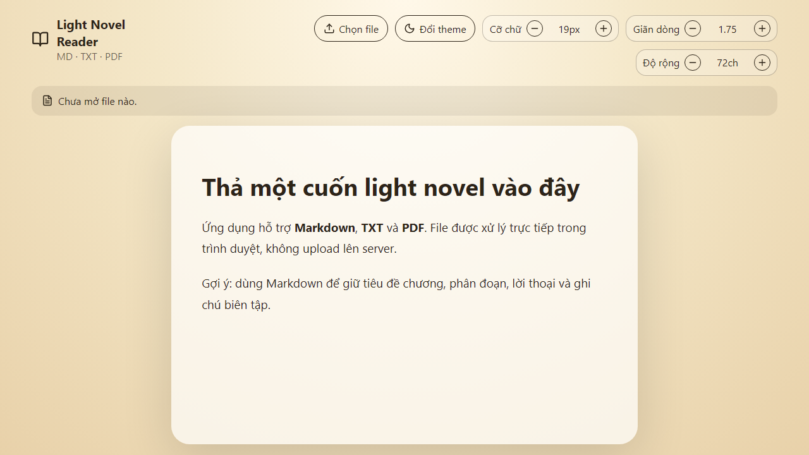

# Light Novel Reader

Ứng dụng web đọc light novel từ file cục bộ: Markdown (`.md`), text (`.txt`) và PDF (`.pdf`).

## Demo



## Tính năng MVP

- Kéo-thả hoặc chọn file từ máy.
- Render Markdown an toàn thành HTML.
- Đọc TXT và giữ xuống dòng theo đoạn.
- Trích xuất nội dung PDF bằng `pdfjs-dist`.
- Tuỳ chỉnh theme sáng/tối/sepia, cỡ chữ, độ rộng dòng.
- Không upload file; xử lý trong trình duyệt.

## Chạy local

```bash
npm install
npm run dev
```

## Kiểm thử/build

```bash
npm test
npm run build
```

## Cấu trúc

```text
src/
  components/ReaderControls.tsx
  lib/fileReaders.ts
  lib/preferences.ts
  test/*.test.ts
```
