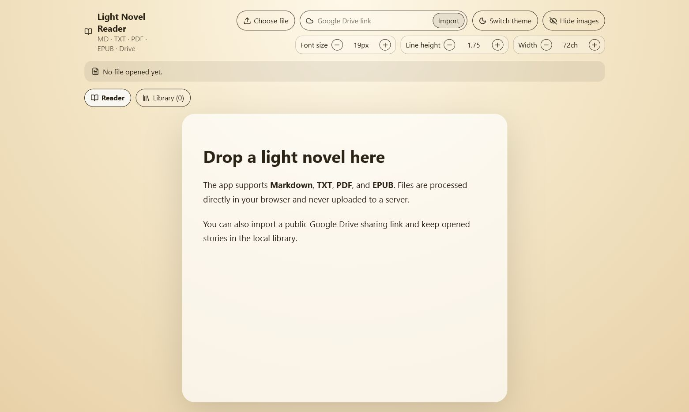

# Light Novel Reader

A local-first light novel reader for Markdown (`.md`), text (`.txt`), PDF (`.pdf`), and EPUB (`.epub`) files. Run it in a browser during development or package it as a portable Windows desktop app with Electron.

## Demo



## MVP Features

- Drag and drop or choose a file from your device.
- Safely render Markdown as HTML.
- Read TXT files while preserving paragraph line breaks.
- Extract PDF text with `pdfjs-dist`.
- Read EPUB spine content and preserve embedded illustration images.
- Import public Google Drive sharing links for supported file types.
- Save opened stories to a local Library tab for quick reopening.
- Read in a responsive single-page or two-page book layout.
- Choose left-to-right or right-to-left page turns independently from text direction.
- Navigate pages with edge controls, keyboard shortcuts, or the page scrubber.
- Save reading progress per story and resume from the last position.
- Navigate chapters and generated reading landmarks from the table of contents.
- Create multiple bookmarks per story and jump back to saved positions.
- Highlight selected text and manage saved highlights.
- Customize light/dark/sepia themes, font size, line height, and content width.
- Hide or restore images and EPUB illustrations with a persistent reader setting.
- No uploads; files are processed in the browser.

## Google Drive import

Paste a Google Drive file sharing link into the import box. The file must be shared as **Anyone with the link** and must be one of the supported formats: `.md`, `.txt`, `.pdf`, or `.epub`.

## Run locally

```bash
npm install
npm run dev
```

## Test/build

```bash
npm test
npm run build
npm run dist:win
```

The Windows portable executable is generated in `../lightnovel-reader-release/` as `LightNovelReader-<version>-portable.exe`.

## Structure

```text
src/
  App.tsx
  styles.css
  components/ReaderControls.tsx
  lib/fileReaders.ts
  lib/googleDrive.ts
  lib/highlights.ts
  lib/library.ts
  lib/preferences.ts
  lib/readingProgress.ts
  lib/tableOfContents.ts
  test/*.test.ts
electron/
  main.cjs
```
